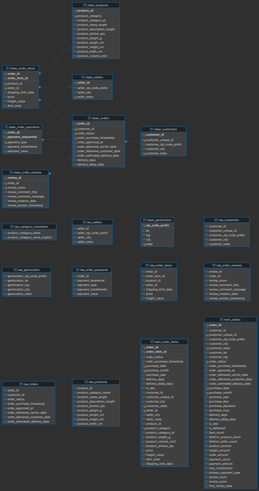
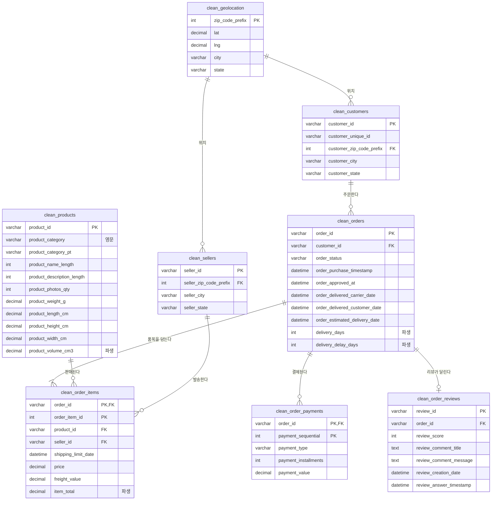

# ERD

## 실제 스키마 (DBeaver)

`clean_*` 사이의 연결선이 `03_add_foreign_keys.sql` 로 건 외래키 6개다.
`raw_*` 는 적재 전용이라 FK 가 없어 선 없이 떠 있고, `clean_geolocation` 도 마찬가지로
연결선이 없다 (아래 참고).

`mart_orders` / `mart_order_items` 는 BI 도구가 바라보는 층이다. 이미 조인이 끝난
결과라 서로 연결하지 않는다 (그레인이 달라 조인하면 행이 부풀려진다).

> DBeaver 는 메타데이터를 캐싱한다. FK 를 건 뒤에도 선이 안 보이면
> 좌측 트리에서 `olist` 우클릭 → Refresh (F5) 후 다이어그램 탭을 다시 연다.

## 논리 ERD (clean_*)

FK 제약은 `03_add_foreign_keys.sql` 에서 6개를 건다.

`clean_geolocation` 만 예외로 FK 없이 둔다. zip prefix 커버리지가 불완전해서
(customers 278행, sellers 7행이 매칭 없음) FK 를 걸면 ALTER 가 실패한다.
좌표 참조용 lookup 테이블로만 쓰고, 조인은 zip prefix 로 직접 한다.
